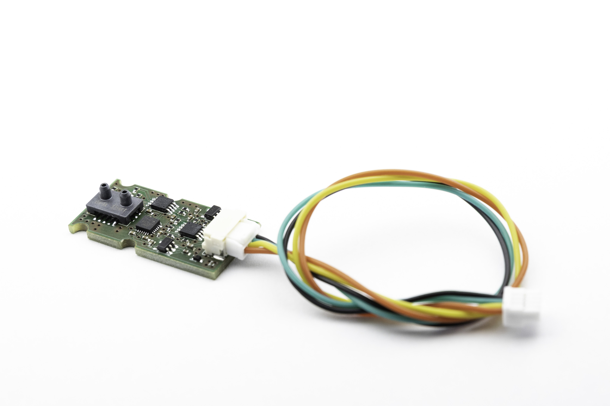
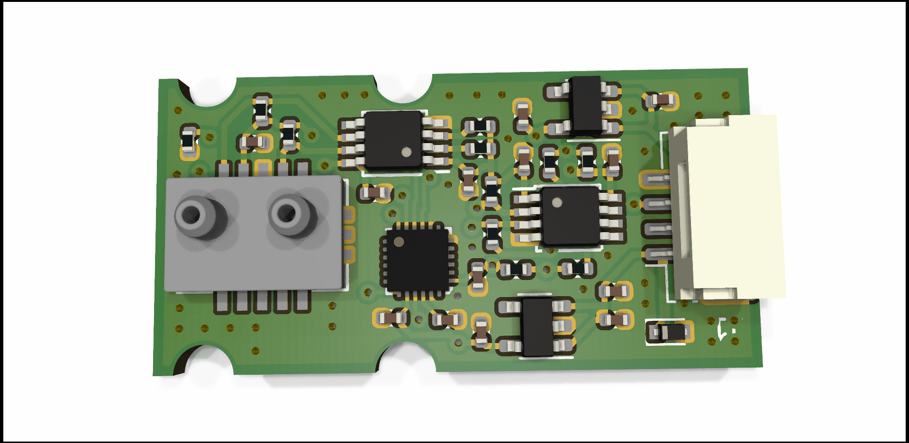
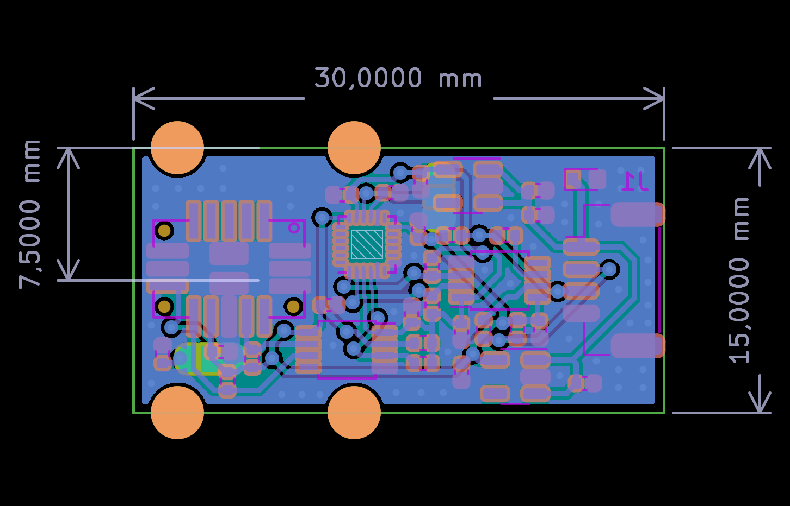
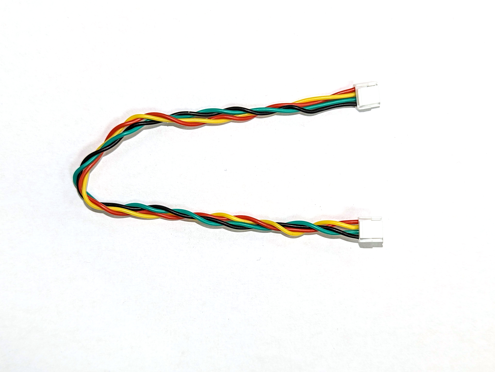

# TFASPDIMU02 - Differential pressure sensor and IMU

ThunderFly TFASPDIMU02 is I2C bus sensor board equipped with a differential pressure sensor ([Sensirion SDP3x](https://www.sensirion.com/sdp3x/)) and 9-axis motion tracking sensor ([ICM-20948](https://invensense.tdk.com/products/motion-tracking/9-axis/icm-20948/)). The board is equipped with a 4-pin JST-GH connector. The sensor board is designed for multiple uses. It can be used as a self-adjusting anemometer [WINDGAUGE03](https://github.com/mlab-modules/WINDGAUGE03) or as an airspeed sensor for UAVs with optional function as the external magnetometer. The featured use (after firmware improvement) could be an angle of attract sensor, stall detector, or vibration (Flutter) detector.

TFASPDIMU is commercially available from [ThunderFly s.r.o.](https://www.thunderfly.cz/), write an email to info@thunderfly.cz or shop at [Tindie store](https://www.tindie.com/stores/thunderfly/).

## Specification
 * Type: Differential and 9-axis motion sensor board
 * Mass: 3 g
 * Size: 30 x 15 mm
 * Power input: +5 V
 * Connection: 4pin JST-GH connector PixHawk compatible

**SDP3x differential pressure sensor**
 * Range: +/- 125/500/1500 Pa (depending on exact sensor type)
 * Excellent accuracy and repeatability, even below one Pascal
 * No zero-point offset, no temperature drift
 * Calibrated and temperature-compensated
 * Fast sampling time of 2kHz at 16 bit resolution
 * I2C address: 0x21 (0d33), could be changed by JP2 and/or resorderig the R10 value.

 **ICM-20948 9-axis IMU unit**
 * 3-axis gyroscope, 3-axis accelerometer, 3-axis compass (magnetometer)
 * Onboard Digital Motion Processor (DMP)
 * On-chip 16-bit ADCs and Programmable Filters
 * 7 MHz SPI or 400 kHz Fast Mode I²C
 * Digital temperature sensor
 * Default I2C address: 0x68 (0d104), can be changed to 0x69 (0d105) by adjusting the JP1.

## Example of uses

### WINDGUAGE - weather vane sensor 

Ground control station anemometer [WINDGAUGE03](https://github.com/mlab-modules/WINDGAUGE03) is based on a TFASPDIMU sensor which is used for both wind direction and wind speed measurement. 

### TFSLOT01 - UAV airspeed sensor

Our [TFSLOT](https://github.com/ThunderFly-aerospace/TFSLOT01) sensor is an airspeed sensor for use mainly on UAVs. Due to the 3D printed case, it is possible to optimize housing according to the location of the sensor on the UAV and tune its characteristics. The first use of this sensor was on our autogyro [TF-G2](https://github.com/ThunderFly-aerospace/TF-G2/).

More details about this solution are available in the repository [TFSLOT01](https://github.com/ThunderFly-aerospace/TFSLOT01).

### TFPIPE01 - UAV airspeed sensor

The symmetric variant of TFSLOT sensor for different mounting options [TFPIPE01](https://github.com/ThunderFly-aerospace/TFPIPE01).

### TFVENTUFO - innovative anemometer

This anemometer is also based on the venturi effect. Thanks to a clever design, it will measure the wind speed from all directions (without knowing the direction).

### Angle of Attack sensor

In case of mounting on slip-ring bearing the sensor could sense air AoA of the vehicle.

### Stall detector

The venturi geometry could also be inverted therefore the pressure ports look in open airflow. That results in the ability to detect stalls on wings by detecting the absence of pressure difference and increasing pressure fluctuations on the wing surface. 

## Hardware

### Electronics schema

Full schema is available in [PDF](/hw/sch_pcb/TFASPDIMU02A.pdf)

### PCB dimensions

Pressure sensor connections are aligned to the center of the PCB width.

### I2C connector pinout

|Signal | Pixhawk Color | ThunderFly color |
|--------|------------------|---------------------|
| +5V  | Red             |    Red                   |
| SCL  | Black          |   Yellow                |
| SDA  | Black          |   Green                |
| GND | Black          |  Black                 |

> Pixhawk pinout is listed according to the [Pixhawk connector standard](https://github.com/pixhawk/Pixhawk-Standards/blob/master/DS-009%20Pixhawk%20Connector%20Standard.pdf).

#### PixHawk autopilot connection cable

To increase the transmission quality, it is mandatory to create twisted pairs of SDA, GND, and SCL,+5V on the cable (as shown in the image)

- 10 twists for each pair  SCL/+5V and SDA/GND per 30cm cable length
- 4 turns/twists of pairs per 30cm cable length.

## Usage

### Python
For reading data from the sensor, we have prepared a Python script in the [PyMLAB](https://github.com/MLAB-project/pymlab) library that uses the pySMBus to read data. It can be used directly from a computer with a corresponding converter (for example MLAB [USBI2C01A](https://wiki.mlab.cz/doku.php?id=cs:usbi2c)) or with one-board computers (Odroid, raspberry, and similar) that have own smbus output.

#### Calibration verification

Calibration can be verified by mounting an anemometer to the car roof and comparing it to speed obtained from GPS (gpsd). This needs to be done in windless weather.

### PX4

> There exists a [pull-request of modified SDP33 driver into PX4 stack](https://github.com/PX4/PX4-Autopilot/pull/18593).

The main use of this sensor is as an airspeed sensor. It can be also used as an external magnetometer and thermometer.

### Ardupilot

We are currently unable to implement the sensor in the Ardupilot flight stack. However, we will be happy to provide assistance with implementation. You can [contact us](https://www.thunderfly.cz/contact-us.html)
