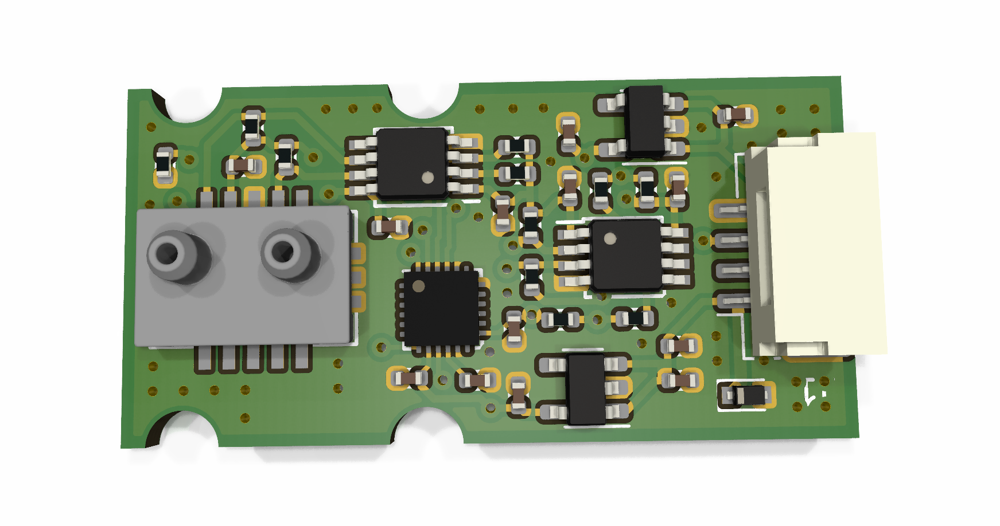

# TFASPDIMU02 - sdp3x differential pressure sensor and IMU 9-axis unit

ThunderFly TFASPDIMU02 is I2C bus sensor board equipped with a differential pressure sensor ([Sensirion SDP3x](https://www.sensirion.com/sdp3x/)) and 9-axis motion tracking sensor ([ICM-20948](https://invensense.tdk.com/products/motion-tracking/9-axis/icm-20948/)). Board is equipped with 4pin JST-GH connector. The sensor board is designed for multiple uses. It can be used as a self-adjusting anemometer [WINDGAUGE03](https://github.com/mlab-modules/WINDGAUGE03) or as an airspeed sensor for UAVs with optional function as the external magnetometer. The featured use (after firmware improvement) could be an angle of attract sensor or vibration (Flutter) detector.

## Specification
 * Type: Differential and 9-axis motion sensor board
 * Mass: 3 g
 * Size: 30 x 15 mm
 * Power: +5 V
 * Connection: 4pin JST-GH connector PixHawk compatible

**SDP3x**
 * Range: +/- 125/500/1500 Pa (depending on exact sensor type)
 * Excellent accuracy and repeatability, even below one Pascal
 * No zero-point offset, no temperature drift
 * Calibrated and temperature compensated
 * Fast sampling time of 2kHz at 16 bit resolution
 * I2C address: 0x21 (0d33), could be changed by JP2 and/or resorderig the R10 value.

 **ICM-20948**
 * 3-axis gyroscope, 3-axis accelerometer, 3-axis compass (magnetometer)
 * Onboard Digital Motion Processor (DMP)
 * On-Chip 16-bit ADCs and Programmable Filters
 * 7 MHz SPI or 400 kHz Fast Mode I²C
 * Digital temperature sensor
 * Default I2C address: 0x68 (0d104), can be changed to 0x69 (0d105) by adjusting the JP1.

## Example of uses

### WINDGUAGE01

Ground control station anemometer [WINDGAUGE03](https://github.com/mlab-modules/WINDGAUGE03)

### TFSLOT01 - UAV airspeed sensor

Our [TFSLOT](https://github.com/ThunderFly-aerospace/TFSLOT01) senzor is an airspeed sensor for use mainly on UAV. Due to 3D printed case it is possible to optimalize part according to the location of sensor on UAV and tune their characteristics. First use of this sensor was on our autogyro [TF-G2](https://github.com/ThunderFly-aerospace/TF-G2/).

More details about this solution is available in the repository [TFSLOT01](https://github.com/ThunderFly-aerospace/TFSLOT01).

### TFPIPE01 - UAV airspeed sensor

Symmetric variant of TFSLOT sensor for different mounting options [TFPIPE01](https://github.com/ThunderFly-aerospace/TFPIPE01).

### TFVENTUFO - innovative anemometer

This anemometer should also based on venturi effect. Thanks to an clever design, it will measure the wind speed from all directions (without knowing the direction).

### Angle of Attack sensor

In case of mounting on slip-ring bearing the sensor could sense air AoA of the vehicle.

## Hardware

### Electronics schema

Full schema is available in [PDF](/hw/sch_pcb/TFASPDIMU02A.pdf)

### PCB dimensions

Pressure sensor connections are aligned to center of PCB width.

### I2C connector pinout

|Signal | Pixhawk Color | ThunderFly color |
|--------|------------------|---------------------|
| +5V  | Red             |    Red                   |
| SCL  | Black          |   Yellow                |
| SDA  | Black          |   Green                |
| GND | Black          |  Black                 |

#### PixHawk autopilot connection cable

To increase the transmission quality, it is mandatory to create twisted-pairs of SDA,GND and SCL,+5V on the cable (as shown in the image)

- 10 twists for each pair  SCL/+5V and SDA/GND per 30cm cable length
- 4 turns/twists of pairs per 30cm cable length.

| TFASPDIMU02 Pin | Signal | Pixhawk | Color |
| ---------------:|:-----:|:-------:|-------|
|   1             | +5V   |  1      | Red   |
|   2             | SCL   |  2      | Yellow|
|   3             | SDA   |  3      | Green |
|   4             | GND   |  4      | Black |

> Pixhawk pinout is listed according to the [Pixhawk connector standard](https://github.com/pixhawk/Pixhawk-Standards/blob/master/DS-009%20Pixhawk%20Connector%20Standard.pdf).

## Usage

### Python
For reading data from the sensor, we have prepared a python script in PyMLAB library that uses the pySMBus to readout data. It can be used directly from a computer with a corresponding converter (for example MLAB [USBI2C01A](https://wiki.mlab.cz/doku.php?id=cs:usbi2c)) or with one-board computers (Odroid, raspberry and similar) that have own smbus output.

#### Calibration vertification
Calibration can be verified by mounting of an anemometer to car roof and comparing it to speed obtained from GPS (gpsd). This needs to be done in windless weather.

### PX4
> We are now working on implementation of driver into PX4 stack.

Main usage of this sensor is as airspeed sensor. It can be also used as an external magnetometer and thermometer.

### Ardupilot
We are currently unable to implement the sensor in the Ardupilot flight stack. However, we will be happy to provide assistance with implementation. You can [contact us](https://www.thunderfly.cz/contact-us.html)

#### configuration
*TODO*
